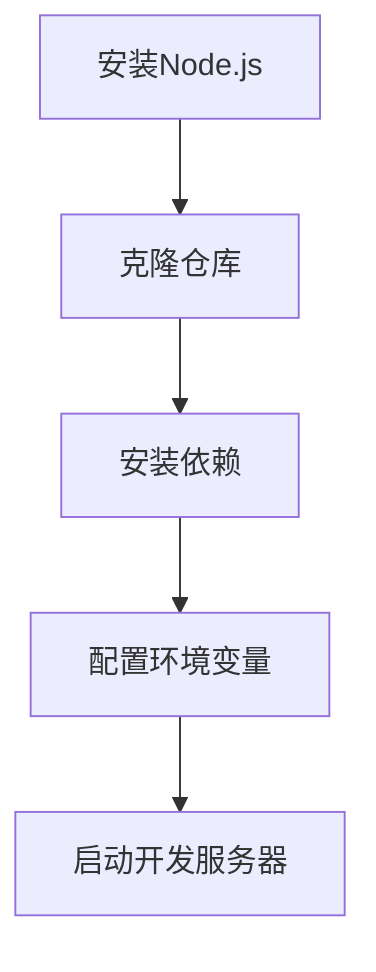

# ClassManer 班级信息管理系统


## 🚀 项目简介

ClassManer 是为高校班级打造的现代化信息管理平台，集成了通知公告、匿名留言、活动影像、优秀作品展示等核心功能模块。

## 🌟 主要功能

### 核心模块
- 👥 用户权限管理
- 📢 实时通知公告
- 🕵️ 匿名留言系统
- 📸 活动影像管理
- 🎨 优秀作品展示

### 特色功能
- 🔒 JWT身份认证
- 📱 响应式布局
- 📊 可视化数据统计
- 📦 文件云存储

## 🛠️ 技术栈

### 前端技术
- Vue3 + Vite + TypeScript
- Element-Plus UI框架
- Axios网络请求
- TinyMCE富文本编辑器

### 后端技术
- FastAPI + Python3.10
- SQLAlchemy ORM
- MySQL数据库
- Redis缓存
r
## ⚙️ 安装指南

## 🔧 环境配置

### 前端环境配置
📦 依赖安装：
```bash
npm install
```

⚙️ 环境变量配置（.env.development）：
```env
VITE_API_BASE=http://localhost:8000
VITE_APP_TITLE="ClassManer"
```

🚀 运行脚本说明：
```json
{
  "scripts": {
    "dev": "vite --mode development",
    "build": "vite build --mode production",
    "preview": "vite preview --port 4173"
  }
}
```

📊 配置流程图：


### 后端环境配置
🐍 Python虚拟环境：
```bash
python -m venv venv
venv\Scripts\activate  # Windows
```

🔌 MySQL连接池配置（database.py）：
```python
from sqlalchemy import create_engine
from sqlalchemy.orm import sessionmaker

engine = create_engine(
    f"mysql+pymysql://{settings.DB_USER}:{settings.DB_PASSWORD}@{settings.DB_HOST}:{settings.DB_PORT}/{settings.DB_NAME}?charset=utf8mb4",
    pool_size=20,
    max_overflow=10,
    pool_recycle=3600
)
```

🚀 FastAPI启动参数：
```bash
uvicorn main:app --reload --workers 4 --host 0.0.0.0 --port 8000
```

🔐 安全配置要求：
- 启用HTTPS
- JWT密钥轮换周期 ≤ 7天
- API请求频率限制

📌 部署流程图：
```mermaid
flowchart LR
    A[安装Python3.10] --> B[创建虚拟环境]
    B --> C[安装依赖]
    C --> D[数据库迁移]
    D --> E[启动FastAPI]


### 部署注意事项
1. 生产环境需替换为真实API地址
2. 切勿将敏感信息提交到版本控制
3. 建议配合以下安全措施：
   - 启用HTTPS
   - 配置CORS白名单
   - 定期轮换访问密钥

### 运行脚本示例
```json
// package.json
{
  "scripts": {
    "dev": "vite --mode development",
    "build": "vite build --mode production",
    "preview": "vite preview --mode production"
  }
}
```

### 环境要求
- Node.js 18+
- Python 3.10+
- MySQL 8.0+


## 🔧 配置说明

1. 复制`.env.example`为`.env`
```bash
cp .env.example .env
```

2. 配置数据库连接信息：
```ini
DATABASE_URL=mysql+pymysql://<user>:<password>@<host>:<port>/<database>
```

## 🤝 贡献指南

欢迎通过以下方式参与贡献：
1. 提交issue报告问题
2. Fork项目并提交PR
3. 完善项目文档

代码规范要求：
- 遵循ESLint代码规范
- 组件使用PascalCase命名
- API接口RESTful风格

## 📄 证书

[MIT License](LICENSE)

---

🛠️ 持续开发中 | 📧 contact@classmaner.com | <!--🌐 [在线演示](https://demo.classmaner.com)-->
