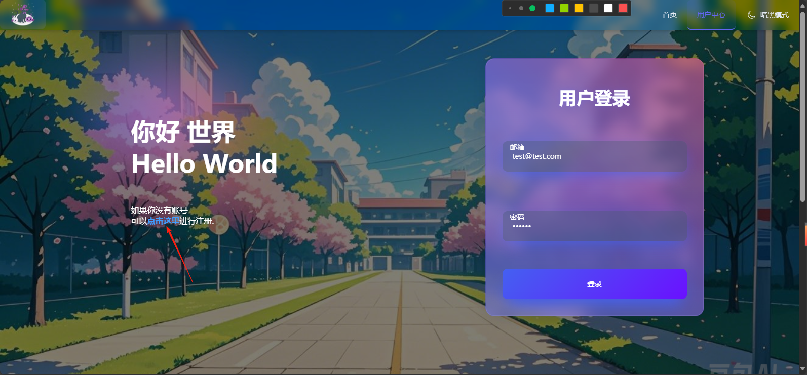
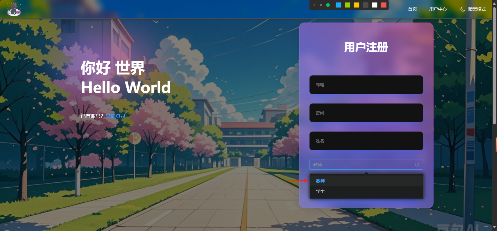

# ClassManer 前端安装指南

## 环境要求

- Node.js 18+
- npm 或 yarn

## 安装步骤

### 1. 克隆项目
```bash
git clone https://github.com/HuYihe2008/ClassManner-V1.0.git
cd ClassManner-V1.0
```

### 2. 安装依赖
```bash
npm install
# 或
yarn install
```

### 3. 配置环境变量
复制 `.env.example` 为 `.env.development`(开发环境) ；
复制 `.env.example` 为 `.env.production`(生产环境) ；
修改相关配置：
```dotenv
VITE_API_BASE_URL=http://localhost:8000 # 实际后端API可访问地址
```

### 4. 启动开发服务器
```bash
npm run dev
# 或
yarn dev
```

### 5. 构建生产版本
```bash
npm run build
# 或
yarn build
```

### 6. 运行生产服务器
```bash
npm run preview
# 或
yarn preview
```

### 7.构建可执行程序
```bash
npm run electron:build
# 或
yarn electron:build
```
打开项目目录下的buileder，即可找到安装文件与软件打包压缩包 `此时打包使用的环境配置为生产环境`

### 8.示例用户使用
#### 8.1.用户注册（由于数据库在API启动时自动创建，默认为空，需要手动注册用户）
进入网页后点击右上角 `用户中心` 
点击 `点击这里`注册

注意`身份`选择教师才可以获取所有权限


## 项目结构
```
/
├── package.json    # 项目依赖
├── .env.example    # 环境变量模板
├── buileder/       # Electron打包文件
├── dist/           # 生产环境构建文件
├── src/
│   ├── assets/     # 静态资源
│   ├── components/ # 组件
│   ├── views/      # 页面
│   ├── router/     # 路由配置
│   ├── store/      # 状态管理
│   └── api/        # API接口
├── public/         # 公共文件
└── vite.config.ts  # Vite配置
```
